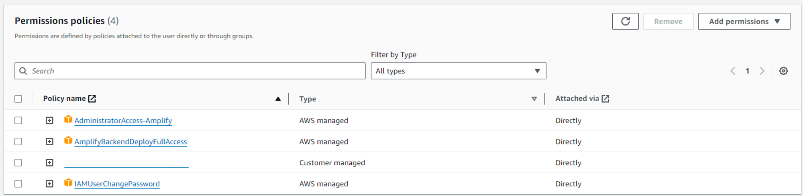

# Amplify front Build 작업 중 Error

> [!CAUTION]  
> amplify build error Amplify AppID [Appid] not found.

build가 안되는 이유를 생각해 보다 IAM 권한 문제로 예상되어 IAM Policies에 `AmplifyBackendDeployFullAccess` 권한을 추가해주었다.

추가로 App settings:General 에서 Service role을  

기존  
`AWSAmplifyCodeCommitExecutionRole-[appid]`  

변경  
`amplifyconsole-backend-role`

위와 같이 변경했다.

기존 role은 cloudWatch Logs와 CodeCommit policy만 있어서 에러가 발생한 것으로 추정한다.