# Amplify front 이관 작업 진행 과정

## 기존 Github에 있던 front Repo를 CodeCommit으로 이관
- AWS에서 CodeCommit repo 생성
- 아래 작업 진행 후 생성한 CodeCommit Repo로 local에서 `git push`
<br/><br/>

IAM user에서 commit시 사용할 user 선택 후 

1. permissions policies에 CodeCommitFullAccess 넣어준다. 

    (모자이크 처리된 세 번째 줄에 해당. 여기서는 custom policy로 정책 custom하여 넣었다.)

    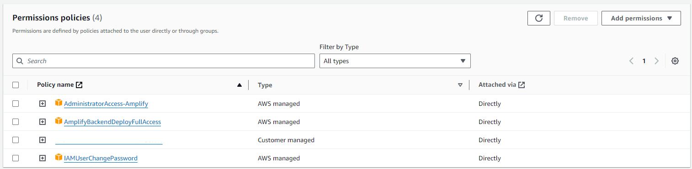

2.  Security credentials의 HTTPS Git credentials for AWS CodeCommit에서 Generate credentials 하여 내려받은 계정으로 remote 로그인

    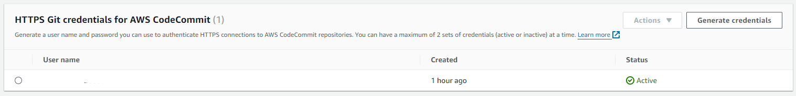

<br/>

이 과정에서 총 2개의 credential 파일과 1개의 accessKey파일이 생성된다.  
- amplify 접속을 위한 **accessKey**
- codeCommit의 repo연결을 위한 **https git credential**
- 해당 유저의 콘솔 접속을 위한 **credential**

<br/>

---  
## Console에서 Amplify 생성 및 설정

1. amplify 콘솔에서 App 생성 후 front 호스팅 연결할 서비스를 선택한다. (codeCommit)

    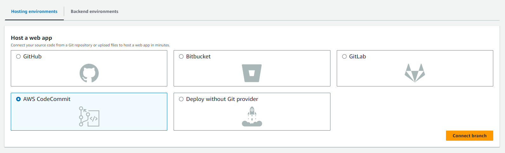


2. Repo 선택 후 트리거링 될 Branch를 선택 후 Next로 넘어간다. 

    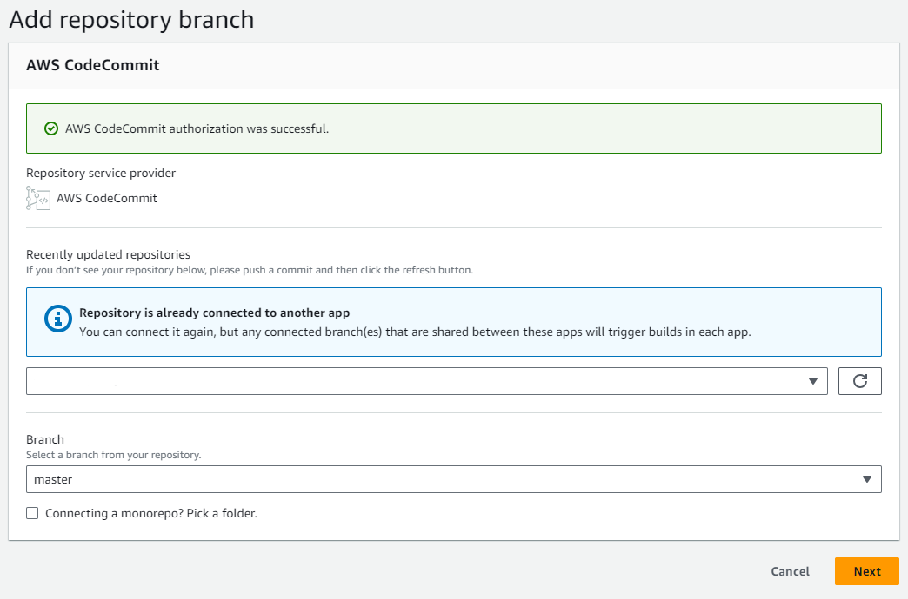


3. 아래 항목은 아무것도 손대지 않고 Next로 넘어간다.
    - App name은 repo명을 따라가기 때문에 다른 이름으로 사용 원할 시 수정한다.

    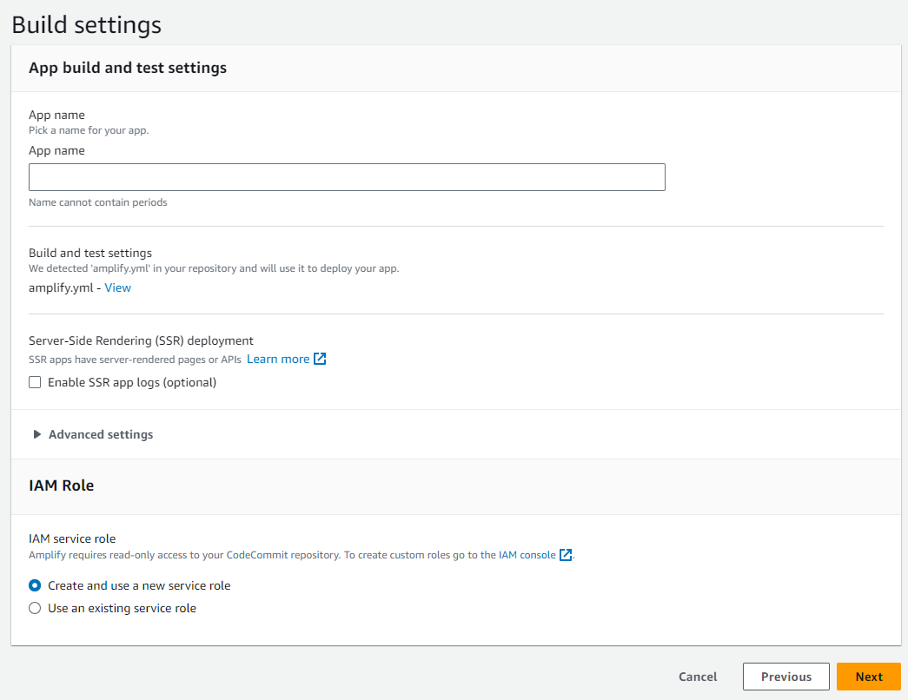

4. 최종 확인 후 Save and deploy 한다.

    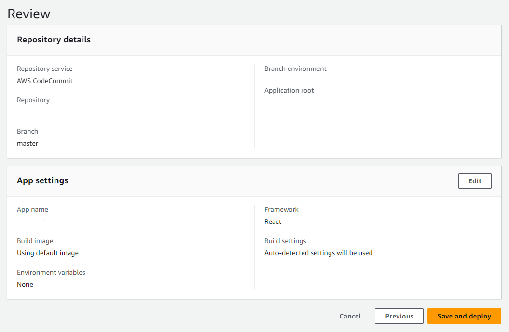

5. 생성된 app에 접속 후 보이는 메인 화면에서 Backend environments 항목 선택 후 Get started
    - Auth(cognito) 사용을 위해 필수적이다.

    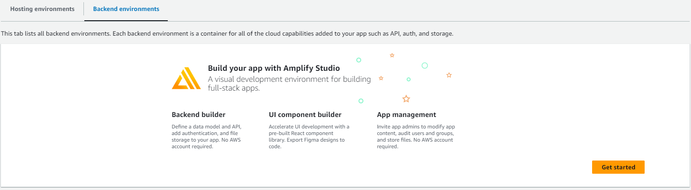
    
<br/>

---
## Amplify 로컬 설정
1. codeCommit에서 local로 front repo를 `git clone` 해온다.
2. local환경에서 기존에 존재하던 amplify관련 파일들(/amplify 및 /src/aws-exports.js)을 삭제한다. (amplify.yml 제외)
3. 프로젝트 CMD에서 `amplify pull`입력 - 생성한 amplify app을 가져온다.  
    위에서 생성한 accessKey ID와 secretKey를 입력하고 이외 정보는 자신이 사용하는 IDE, 언어 등을 선택 또는 입력하여 설정을 완료한다.

    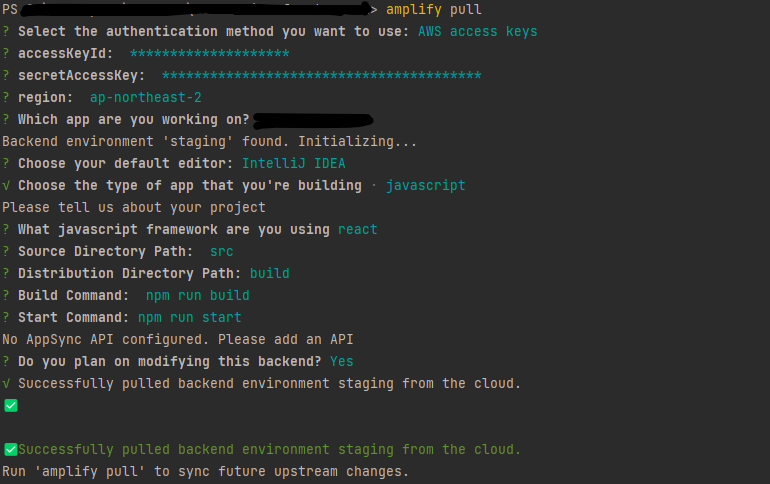

4. auth 사용을 위해 amplify add auth

    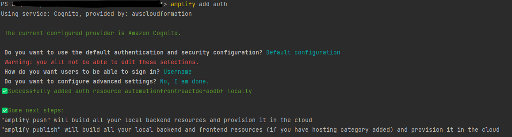

5. 이후 amplify push 명령어로 cloud환경에도 반영해준다.
6. 다시 amplify console에 접속하여 아래 화면에서 edit를 선택한다.

    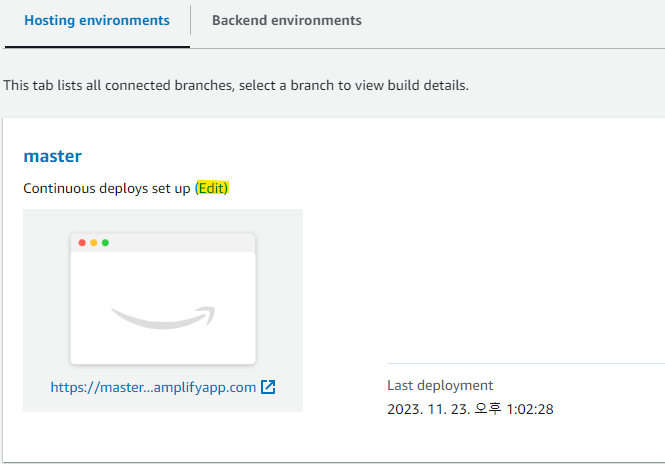

7. backend environment에서 staging을 선택한다.

    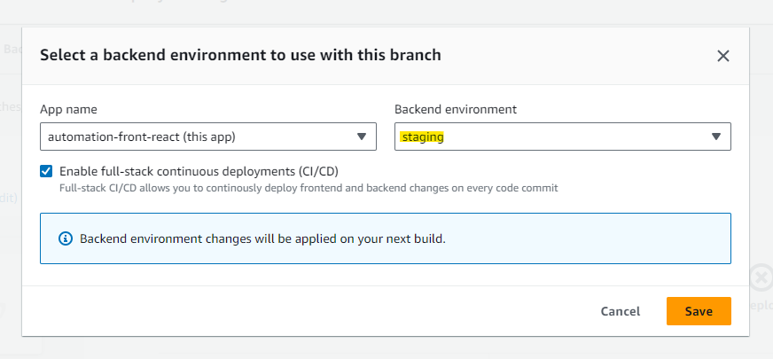

8. staging에 접속해서 edit backend에 나타나 있는 command를 입력해준다.

    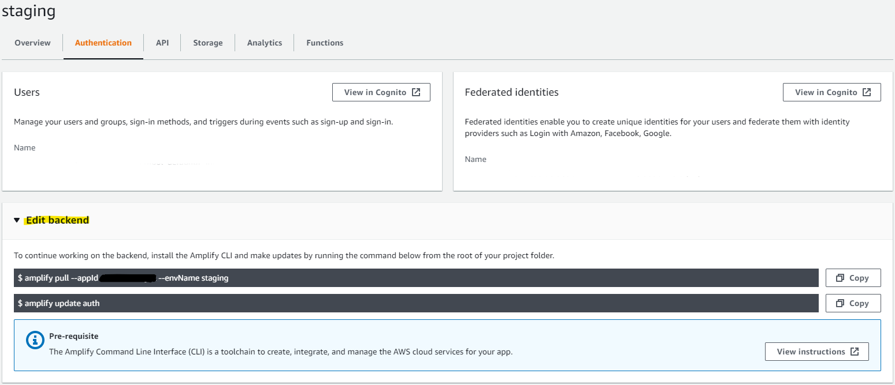

    amplify update auth는 아래와 같이 설정해주었다.
    
    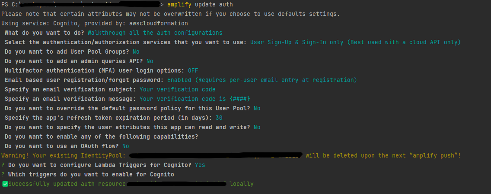

9. `amplify push` 로 반영한다.

App settings:General에서 Service role의 policy에 AdministratorAccess-Amplify가 설정되어 있는지 확인한다.  
이 후 local에서 프로젝트 git push 후 서비스 배포가 성공적으로 돌아가는지 확인한다.
- 위 policy가 없을 경우 amplify build 시 `amplify build error Amplify AppID [appID] not found.` 에러가 발생할 수 있다.

<br/>

버전 에러 발생시 환경 변수 추가  

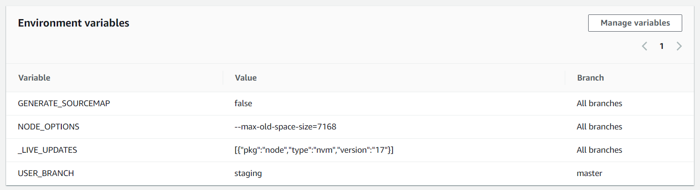

---

+++  

기존 Amplify auth 사용 시 identity pool이 연결이 안되어있어 setting 페이지 접속 시 userList 호출 불가로 인한 에러 발생
~~~
no cognito identity pool provided for unauthenticated access amplify
~~~
<br/>

console에서 user pool 및 identity pool 생성 후

- Identity pool >user access > Identity providers에 user pool 추가
- Identity pool >user access > Authenticated access 의 Authenticated role에 AmazonCognitoPowerUser 권한 추가
    - *두 번째 줄은 아래와 같은 에러 발생 시 확인하여 추가* 
    ```bash
    AccessDeniedException: User: arn:aws:sts::260966982575:assumed-role/automation-front-cognito-role/CognitoIdentityCredentials is not authorized to perform: cognito-idp:ListUsers on resource: arn:aws:cognito-idp:ap-northeast-2:260966982575:userpool/ap-northeast-2_zQywVL7v9 because no identity-based policy allows the cognito-idp:ListUsers action
    ```
        

이 후 local project에서 다음과 같이 진행하였다.  

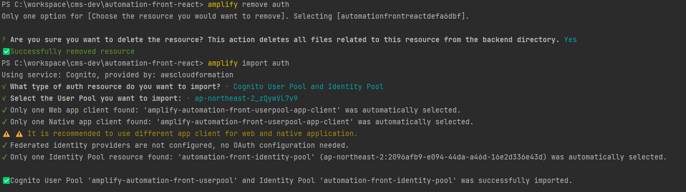

### 마무리로 꼭 amplify push
<br/>

참조: <https://docs.amplify.aws/javascript/build-a-backend/auth/import-existing-resources/>

---
+++

이 후 배포 시 back-end build에러 발생…

identity pool > User access > Authenticated role의 권한 문제 발생 시 authRole이라는 문자열이 포함되어있는 role로 변경

이 후 발생한 에러는 아래 페이지 참조하여 환경변수 설정해주었다.

[https://velog.io/@dlruddms5619/Error-Amplify-배포-에러-Could-not-initialize-categories-for-dev-auth-headless-is-missing-the-following-inputParams-userPoolId-webClientId-nativeClientId](https://velog.io/@dlruddms5619/Error-Amplify-%EB%B0%B0%ED%8F%AC-%EC%97%90%EB%9F%AC-Could-not-initialize-categories-for-dev-auth-headless-is-missing-the-following-inputParams-userPoolId-webClientId-nativeClientId)