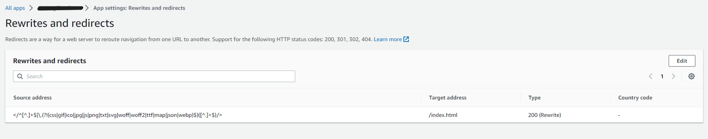

# Amplify 페이지 새로고침 Rewrites 설정 - React App

> **AWS Docs 참조**  
<https://docs.aws.amazon.com/amplify/latest/userguide/redirects.html#trailing-slashes-and-clean-urls>

 

Amplify로 배포한 단일 페이지 웹 앱(SPA)의 하위 페이지 위치에서 새로 고침 할 경우 AccessDenied에러가 발생한다.

> React App에는 SPA(Single Page App) 자체 라우팅이 있으며 AWS 측에서는 기본 경로를 제외한 다른 모든 경로가 서버 측에 없기 때문에 404를 반환합니다. amplify에서 index.html로 리다이렉트 설정을 해두면, react router가 라우팅을 처리합니다.  

싱글톤의 경우 위와 같은 이유 때문에 Amplify console에서 리디렉션 설정을 해주어야 한다.  

Amplify App의 Rewrites and redirects에서 아래와 같이 추가해주면 react router가 자체적으로 라우팅해준다.

Source address | Target address | Type | Country code
---------------|----------------|------|-------------
</^[^.]+\$\|\\.(?!(css\|gif\|ico\|jpg\|js\|png\|txt\|svg\|woff\|woff2\|ttf\|map\|json\|webp)$)([\^.]+\$)/> | /index.html | 200(Rewrite) | -

