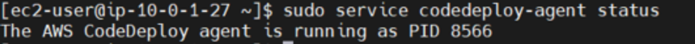

# EC2 CodeDeploy Agent 설치 및 설정

> **AWS CodeDeploy란?**  

Build한 SourceCode를 운영 환경에 자동으로 배포하는 역할을 수행하는 AWS Service이다.

CD, 지속적 배포를 뜻한다.

CodeDeploy의 배포 대상은 ec2/온프레미스 컴퓨팅, lambda 등 여러가지가 존재하지만 ec2에 배포하는 방식으로 진행했다.

 

>인스턴스에서 aws cli를 설정해준다.
~~~
sudo aws configure
~~~

~~~
AWS Access Key ID [None]: [IAM에서 발급받은 Access Key ID 입력]
AWS Secret Access Key [None]: [IAM에서 발급받은 Secret Access Key 입력]
Default region name [None]: ap-northeast-2
Default output format [None]: json
~~~
 

>ruby 와 wget이 없을 경우 설치해준다.
~~~
sudo yum install ruby -y
sudo yum install wget -y
~~~
 

> aws 설정 후 Agent 설치 파일을 다운 받는다.  
> 자신이 접속한 리전에 맞게 agent를 설치해주면 된다.
~~~
wget https://aws-codedeploy-[자신의 리전].s3.[자신의 리전].amazonaws.com/latest/install
~~~

EX) https://aws-codedeploy-ap-northeast-2.s3.ap-northeast-2.amazonaws.com/latest/install
​ 

> 이후 모든 사용자에게 실행 권한을 준다.
~~~
chmod +x ./install
~~~
 

> 최신 버전의 CodeDeploy agent 설치
~~~
sudo ./install auto 
~~~
 

> agent가 실행 중인지 확인한다.
~~~
sudo service codedeploy-agent status

#실행 중이 아닌경우 start
sudo service codedeploy-agent start
~~~
 

위와 같은 문구가 뜰 경우 Agent가 실행 중이다.