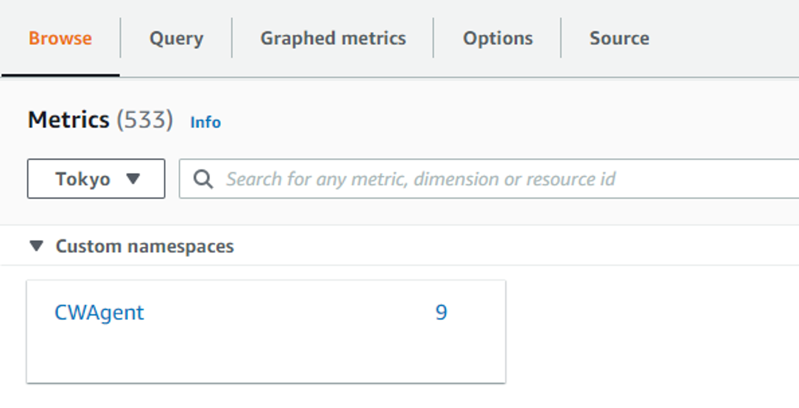
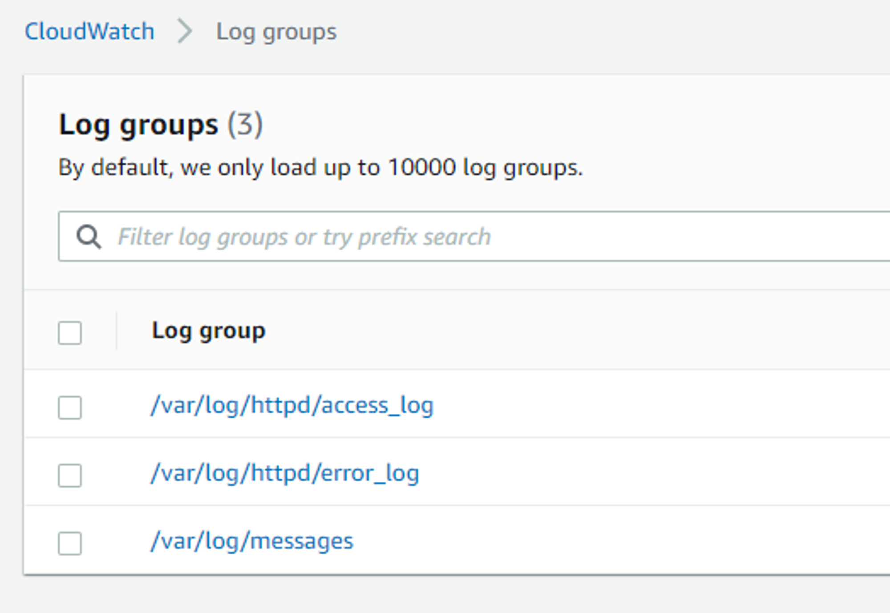

# EC2 CloudWatch Agent 설치 및 Log Stream

## 목차
- [CloudWatch Agent 설치](#cw-agent-install)
- [CloudWatch Logs 설치 및 Stream](#cw-log-stream)
  

## 
CloudWatch Agent 설치

> 다음 명령어로 EC2에 CloudWatch Agent 설치한다.

~~~
sudo yum install amazon-cloudwatch-agent
~~~
 

> 설치가 완료되면, 설치된 마법사 파일을 찾아낸다.
~~~
sudo find / -name amazon-cloudwatch-agent-config-wizard
>> /opt/aws/amazon-cloudwatch-agent/bin/amazon-cloudwatch-agent-config-wizard
~~~
 

>파일 경로로 찾아가 마법사 파일을 실행한다.
~~~
cd /opt/aws/amazon-cloudwatch-agent/bin/
sudo ./amazon-cloudwatch-agent-config-wizard
~~~
 

>마법사 파일 세팅 후, agent 실행
~~~
sudo /opt/aws/amazon-cloudwatch-agent/bin/amazon-cloudwatch-agent-ctl -a fetch-config -m ec2 -c file:/opt/aws/amazon-cloudwatch-agent/bin/config.json -s
~~~
 

~~~
#상태 확인
sudo amazon-cloudwatch-agent-ctl -m ec2 -a status

#실행
sudo amazon-cloudwatch-agent-ctl -m ec2 -a start

#중지
sudo amazon-cloudwatch-agent-ctl -m ec2 -a stop
~~~
 

>이 후 AWS Web Console에서 지표를 확인할 수 있다.
- AWS Web Console - CloudWatch - Metrics - CWAgent

  
 
 

## 
CloudWatch Logs 설치 및 Stream

> Cloud Watch logs를 설치한다.
~~~
sudo yum install -y awslogs
~~~
 

>원하는 로그를 내보내도록 conf 파일을 설정한다.
~~~
sudo vi /etc/awslogs/awslogs.conf
~~~
 

>아래의 코드를 추가한다. (Apache 로그)
~~~
[/var/log/httpd/access_log]
datetime_format = %d/%b/%Y:%H:%M:%S %z
file = /var/log/httpd/access_log
buffer_duration = 60000
log_stream_name = {instance_id}
initial_position = start_of_file
log_group_name = /var/log/httpd/access_log

[/var/log/httpd/error_log]
datetime_format = %d/%b/%Y:%H:%M:%S %z
file = /var/log/httpd/error_log
buffer_duration = 60000
log_stream_name = {instance_id}
initial_position = start_of_file
log_group_name = /var/log/httpd/error_log
~~~
 

- datetime_format : 타임스탬프가 로그에서 추출되는 방법을 지정합니다.
- file : CloudWatch Logs에 푸시하고 싶은 로그 파일을 지정합니다.
- buffer_duration : 로그 이벤트를 일괄 처리하는 기간을 지정합니다.
- log_stream_name : 대상 로그 스트림을 지정합니다.
- initial_position : 데이터 읽기를 시작할 지점을 지정합니다.
- log_group_name : 대상 로그 그룹을 지정합니다.
  

>로그가 저장되는 Region을 변경해준다.
~~~
sudo vi /etc/awslogs/awscli.conf
~~~
 

>아래의 명령어로 loggin 활성화
~~~
sudo systemctl start awslogsd
sudo systemctl enable awslogsd.service
~~~
 

>로그가 잘 들어왔는지 확인한다.
- AWS Web Console - CloudWatch - Logs - Log groups

  
 
 